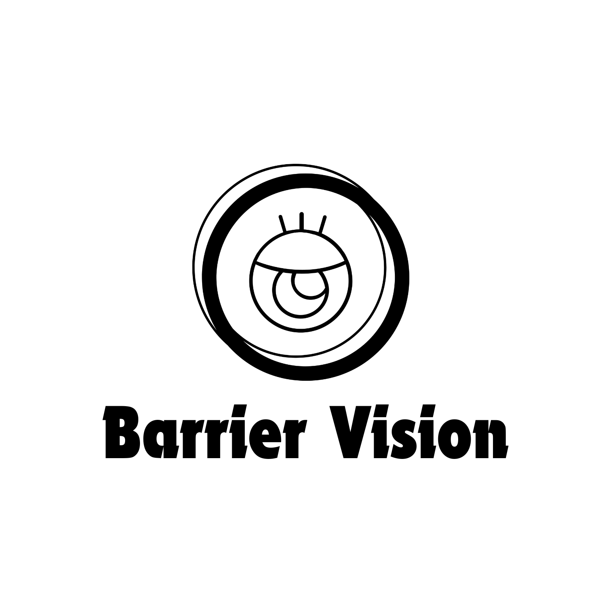

 # 

## プロダクト名

**Barrier Vison** 
車いすユーザーにとってバリアフリーな視界を得られるという意味をこめた

## **エレベーターピッチ** 

車いすユーザーを手助けするために

車いすを使わない人向けの

Barrier Visonというプロダクトは

スマホアプリでARカメラを起動してそのルートが走行可能か判別できるアプリです

これはLiDARセンサーを使用して車いすにとっての障害が検知が可能で

自分に車いすについて知識がなくてる

いつでもどこでも手軽に車いすに優しい環境か理解できる機能が備わっています

## member

215402B 215748K 215764B 215760J
